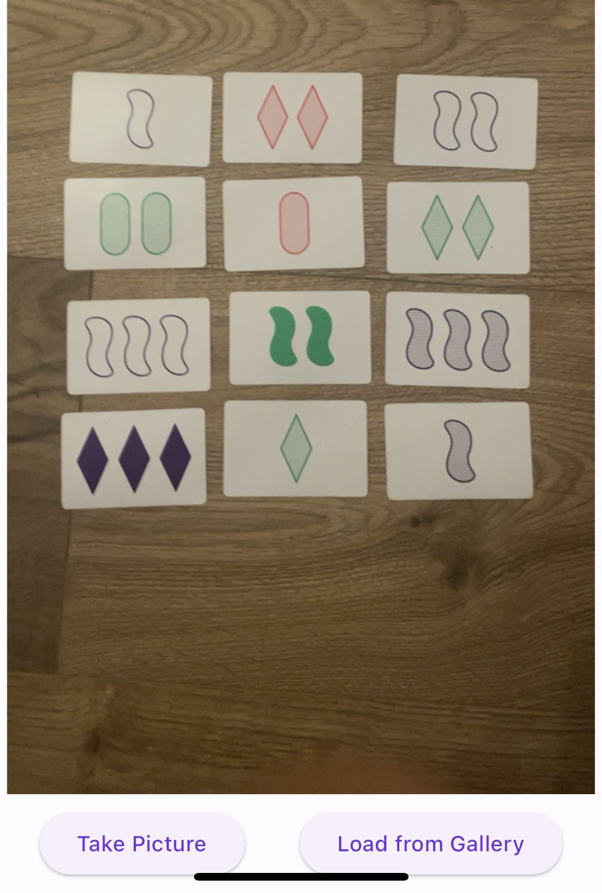
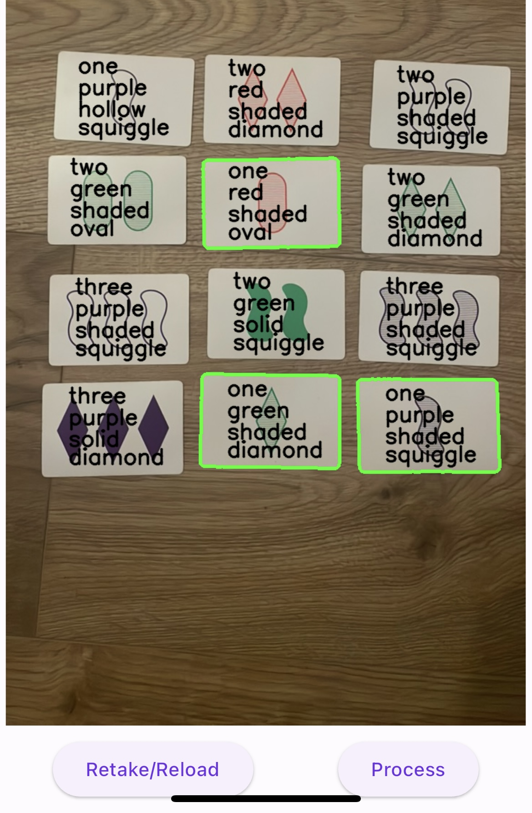
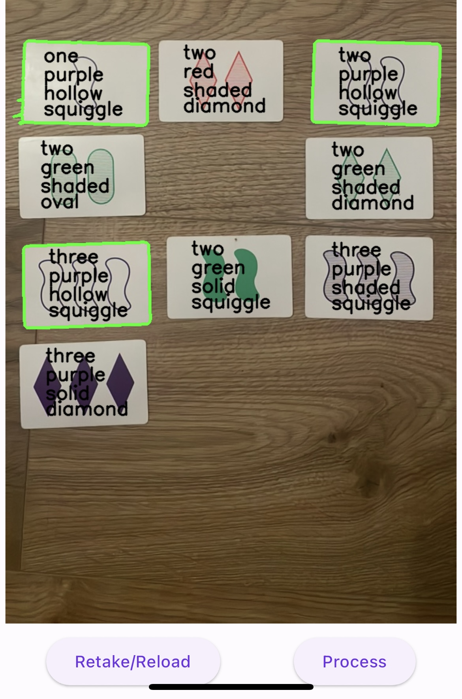
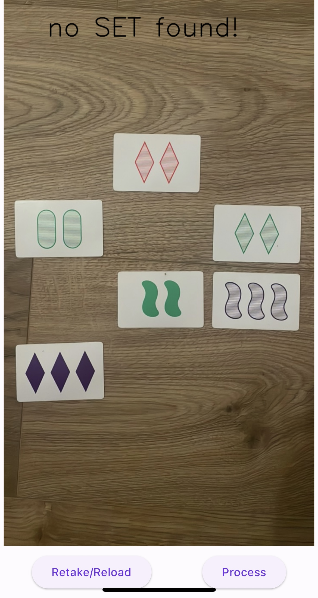

# SET Solver

## Background

This is a solver for the [SET](https://www.setgame.com/set/puzzle) game. See 
the rules for the game [here](https://www.setgame.com/sites/default/files/instructions/SET%20INSTRUCTIONS%20-%20ENGLISH.pdf).

Unlike the online version which guarantees that there are always 6 sets in the 
set of cards you are dealt, in the physical card game it is possible to have 12
cards in front of you that do not contain any sets. The rules state that if 
everyone playing agrees that there is no SET, then an extra row of cards can be
added. However, I think many times the group is perhaps just not seeing a set. 

## Goal

To address this catastrophic dilemma, I'm building a SET-solver that can assist 
in such a situation. The goal is to have an app that you can use to quickly take 
a picture of the cards in front of you and then for it to indicate to you if 
a set is present. 

## Components

This project consists of the following components:

1) Front-end app: Basic Flutter app to capture the image of a set of SET cards 
   and to provide visual feedback about where a set is. It will send the image 
   to a back-end python app. 
2) Python Flask app to respond to queries from the front end. 
3) Edge detector: which will take image and determine where all the cards are
   in the image. Input: single image; Output: multiple images.
4) Classifier: 
   4.1) Card count: this is quite easy to do using heuristics: edge detection 
        of shapes over a certain area.
   4.2) Shape, Colour and Fill: These will be done using 3 different ML models
        that I will train with some data.
5) Solver: 
   Once we know which cards are on the table, the next step is just to find if
   there is a valid set.
6) Report the results back to the front-end app

## What is complete?
 - [x] Brute force solver in Golang. I made it quite general so you could even 
   create a SET game with more dimensions. The algo can defs still be optimised. 
   I will either need to re-write this in Dart or I need to figure out how to 
   package the go application in flutter and call it from there.
 - [x] App: Take pic or load one from gallery
 - [x] Python [Jupyter notebook](/image-processing/edge-detection.ipynb) for 
   edge detection on an image.
 - [x] Python [Jupyter notebook](/image-processing/card-classification.ipynb) 
   for card classification detection on an image.
 - [x] Python Flask App
 - [x] Trained models for colour, shading & fill
 - [x] report card type back to user.

## Next:

- Reproduce the golang solver in python. 
- report back the results to the front end app

