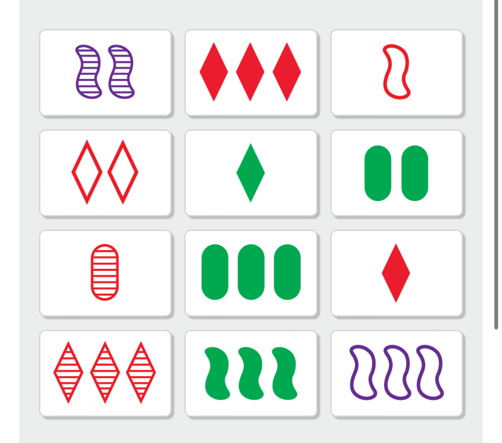

# SET Solver

## Background

This is a solver for the [SET](https://www.setgame.com/set/puzzle) game. See 
the rules for the game [here](https://www.setgame.com/sites/default/files/instructions/SET%20INSTRUCTIONS%20-%20ENGLISH.pdf).

Unlike the online version which guarantees that there are always 6 sets in the 
set of cards you are dealt, in the physical card game it is possible to have 12
cards in front of you that do not contain any sets. The rules state that if 
everyone playing agrees that there is no SET, then an extra row of cards can be
added. However, I think many times the group is perhaps just not seeing a set. 

## Goal

To address this catastrophic dilemma, I'm building a SET-solver that can assit 
in such a situation. The goal is to have an app that you can use to quickly take 
a picture of the cards in front of you and then for it to indicate to you if 
a set is present. 

## Components

This project will need the following components to work:

1) App: A basic app (I will use Dart/Flutter) to capture the image & provide 
  visual feedback about where a SET is on the picture. 
2) Edge detector: which will take the image and determine where all the cards are
  in the image. Input: single image; Output: multiple images.
3) Classifier: This will take each image produced by the edge detector and 
   classify each image into a card. For each image, it must determine: Colour, 
   Count, Shading and Shape. How? Well really this should use an ML model and yes
   that will be a good exercise but first I will just try to use some heuristics. 
4) Solver: Now that we have the set of cards in programmatic form, find any sets. 
5) As a cherry on top: pick on of the SETs found and draw rectangles of those 
   cards on the original image.

## What is complete?
 - [x] Brute force solver in Golang. I made it quite general so you could even 
   create a SET game with more dimensions. The algo can defs still be optimised. 
   I will either need to re-write this in Dart or I need to figure out how to 
   package the go application in flutter and call it from there.
 - [x] App: Take pic or load one from gallery
 - [x] Python [Jupyter notebook](/edge-detection/edge-detection.ipynb) for edge 
   detection on an image.
 - [x] Python [Jupyter notebook](/edge-detection/card-classification.ipynb) for 
   card classification detection on an image.
